# Module 2 — Titanic Analytics

This module performs exploratory data analysis, visualization, classification, class-imbalance analysis, hyperparameter tuning, and regression using the classic Titanic dataset.

## Dataset

The classic Titanic dataset is loaded once using Seaborn in `01_eda.py` and immediately saved as `titanic.csv` for offline reuse. After cleaning, the same CSV is overwritten with the cleaned dataset, and `02_modeling.py` reads this CSV instead of loading the dataset again.

Initial dataset:

- 891 rows
- 15 columns

After cleaning:

- 889 rows
- 14 columns

The committed `titanic.csv` allows the modeling stage to run without loading the dataset from Seaborn again.

## Data Profiling

The dataset was profiled using:

- `df.info()`
- `df.describe()`
- `df.shape`

The initial dataset contains missing values in `deck`, `age`, `embarked`, and `embark_town`.

## Missing-Value Handling

The following rule was used for missing-value treatment:
- Less than 5% missing → drop the affected rows
- 5–30% missing → impute the missing values
- More than 30% missing → drop the column or encode missing values separately based on the feature and analysis requirement
| Column | Missing % | Treatment |
|---|---:|---|
| `deck` | 77.22% | Column dropped |
| `age` | 19.87% | Median imputation |
| `embarked` | 0.22% | Rows dropped |
| `embark_town` | 0.22% | Rows dropped |

The `deck` column had 77.22% missing values, which is above the 30% threshold, so it was dropped because the missing proportion was very high. The `age` column had 19.87% missing values, which falls within the 5–30% range, so its missing values were replaced with the median. `embarked` and `embark_town` each had only 0.22% missing values, so the two affected rows were removed because their missing proportions were below 5%.

After cleaning, all remaining columns contained zero missing values.

## Exploratory Data Analysis

### Age

IQR analysis:

- Q1 = 22.0
- Q3 = 35.0
- IQR = 13.0
- Lower bound = 2.5
- Upper bound = 54.5
- Outliers = 65

The age boxplot identified 65 IQR-based outliers. These observations were retained because unusually high or low ages can still represent valid passenger records.

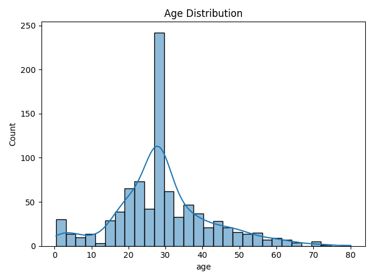

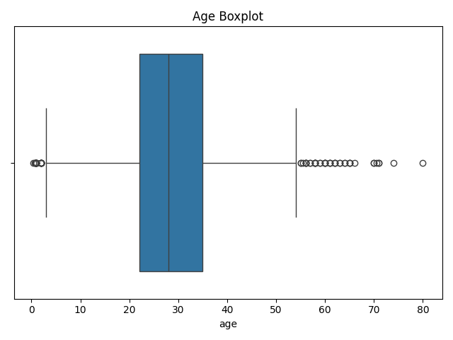

### Fare

Fare statistics:

- Mean = 32.0967
- Median = 14.4542
- Mode = 8.05
- IQR outliers = 114

The fare distribution is right-skewed because the mean is greater than the median, and the median is greater than the mode:

`Mean > Median > Mode`

High fare values were retained because they may represent legitimate passenger fares rather than data-entry errors.

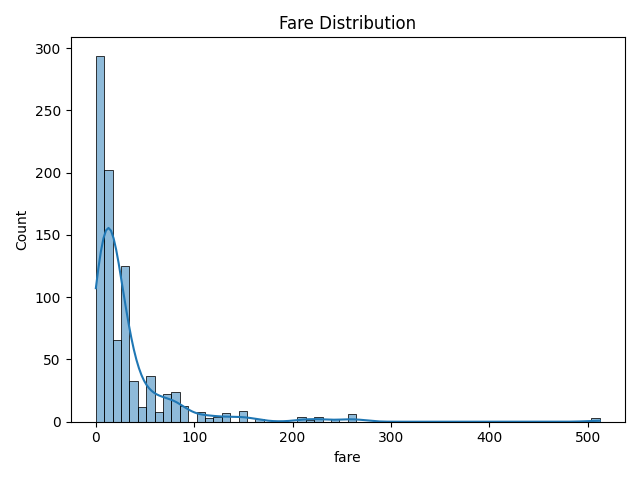

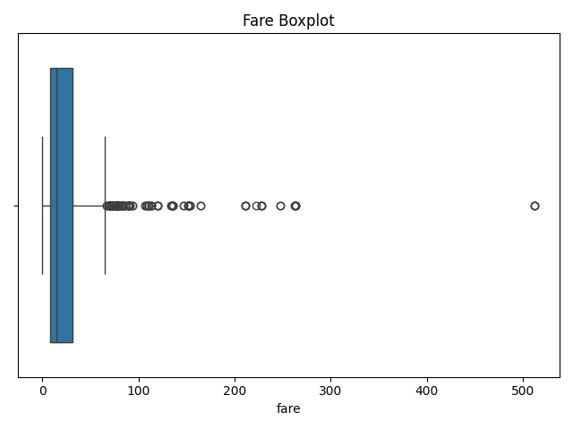

## Survival Analysis

### Survival by Sex

Observed survival rates:

- Female = 74.04%
- Male = 18.89%

Female passengers had a substantially higher observed survival rate than male passengers. The survival rate was 74.04% for females compared with 18.89% for males, showing a strong association between sex and survival in this dataset.

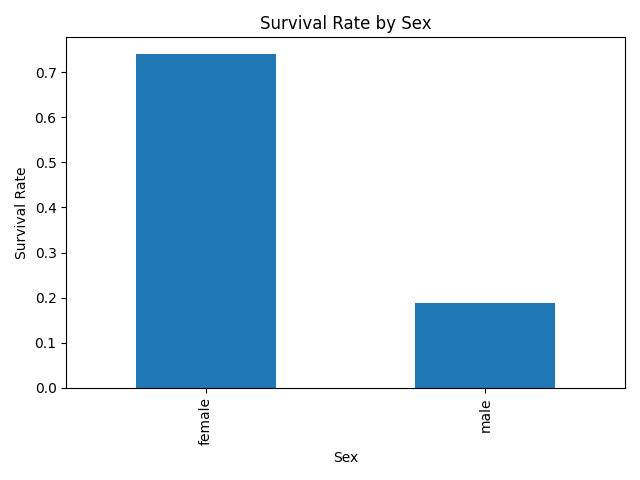

### Survival by Passenger Class

Observed survival rates:

- 1st class = 62.62%
- 2nd class = 47.28%
- 3rd class = 24.24%

Survival rates decreased across passenger classes from first to third class. The observed rates were 62.62% for first class, 47.28% for second class, and 24.24% for third class, indicating a clear relationship between passenger class and survival.

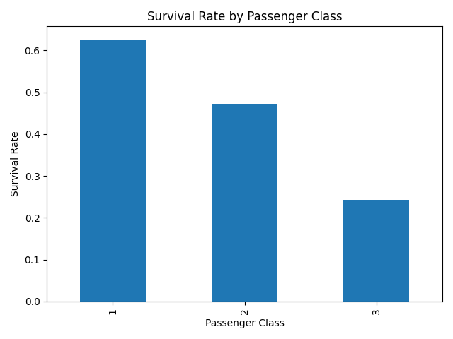

### Survival by Sex and Passenger Class

| Sex | Class | Survival Rate |
|---|---:|---:|
| Female | 1 | 96.74% |
| Female | 2 | 92.11% |
| Female | 3 | 50.00% |
| Male | 1 | 36.89% |
| Male | 2 | 15.74% |
| Male | 3 | 13.54% |

Survival varied across the combination of sex and passenger class. Female passengers in first and second class had survival rates above 90%, while male passengers in second and third class had much lower observed survival rates. The combined view shows how the two variables together provide a more detailed picture of survival differences.

The required group-level calculations were implemented using boolean masking. Conditions using `&` and `|` were also demonstrated for specific passenger groups.

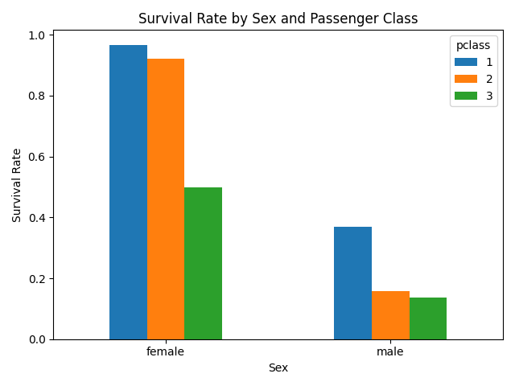

## Correlation Analysis

The correlation matrix was created using exactly these six variables:

- `survived`
- `pclass`
- `age`
- `sibsp`
- `parch`
- `fare`

The variables `adult_male` and `alone` were excluded from the correlation analysis.

The two strongest off-diagonal correlations by absolute value were:

| Variable Pair | Correlation |
|---|---:|
| `pclass` and `fare` | -0.5482 |
| `sibsp` and `parch` | 0.4145 |

The negative correlation between `pclass` and `fare` indicates that the encoded passenger class and fare were inversely related in this dataset. The positive correlation between `sibsp` and `parch` indicates that passengers travelling with more siblings or spouses also tended to have more parents or children aboard.

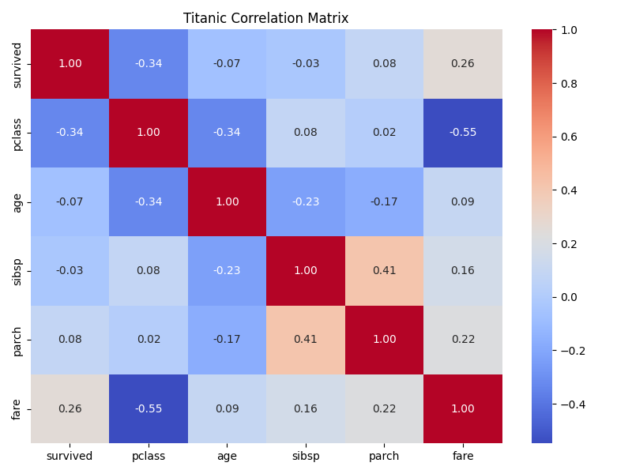

## Data Story

The visual analysis highlights four main relationships. Survival differs substantially by sex, varies across passenger classes, and changes further when sex and class are considered together. The correlation heatmap adds a broader view of relationships among the main numeric variables, with passenger class and fare showing the strongest absolute correlation.

Each visualization was accompanied by a written interpretation based on the observed data.

## Standardization Check

Age and fare were standardized as an exploratory analysis.

Before standardization:

| Statistic | Age | Fare |
|---|---:|---:|
| Mean | 29.3152 | 32.0967 |
| Standard deviation | 12.9849 | 49.6975 |

After standardization:

| Statistic | Age | Fare |
|---|---:|---:|
| Mean | Approximately 0 | Approximately 0 |
| Standard deviation | 1.0000 | 1.0000 |

This confirms that the standardization transformed both variables to approximately zero mean and unit variance. This check was exploratory and was not used as a separate modeling input.

# Classification Modeling

The cleaned dataset was split into training and testing sets using an 80/20 stratified split.

| Dataset | Rows |
|---|---:|
| Training | 711 |
| Testing | 178 |

Stratification was used to preserve the original survival-class distribution in both subsets. This is important because the target contains two classes, and maintaining similar class proportions helps ensure that both the training and test sets are representative of the original data.

Target distribution:

| Dataset | Not Survived | Survived |
|---|---:|---:|
| Training | 61.744% | 38.256% |
| Testing | 61.798% | 38.202% |

## Train-Only Preprocessing

Preprocessing was fitted only on the training data to prevent data leakage.

The preprocessing pipeline used:

- Numeric features: median imputation followed by `StandardScaler`
- Categorical features: most-frequent imputation followed by `OneHotEncoder(handle_unknown="ignore")`
- `ColumnTransformer` to combine the numeric and categorical preprocessing
- `Pipeline` to keep preprocessing and model fitting together

The fitted preprocessing steps were then applied to the test data without refitting.

## Classification Models

Three classifiers were evaluated:

- Logistic Regression
- Decision Tree
- Random Forest

### Model Comparison

| Model | Accuracy | Precision | Recall | F1 | AUC |
|---|---:|---:|---:|---:|---:|
| Logistic Regression | 0.8090 | 0.7833 | 0.6912 | 0.7344 | 0.8610 |
| Decision Tree | 0.7697 | 0.6901 | 0.7206 | 0.7050 | 0.7541 |
| Random Forest | 0.8202 | 0.7813 | 0.7353 | 0.7576 | 0.8179 |

Confusion matrices were generated for all three classifiers, and ROC curves with AUC values were used to evaluate discrimination performance.

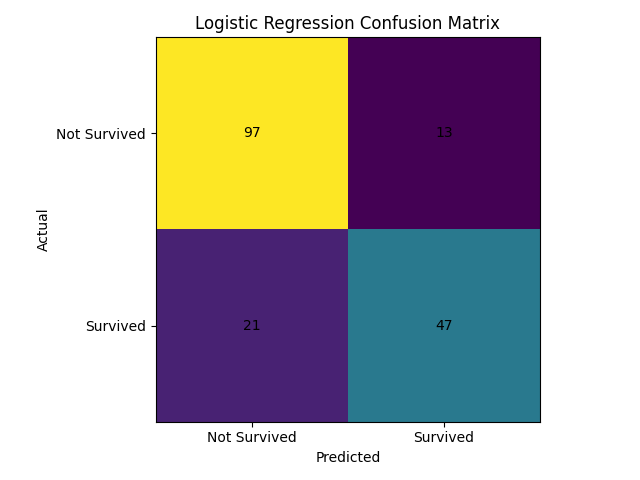

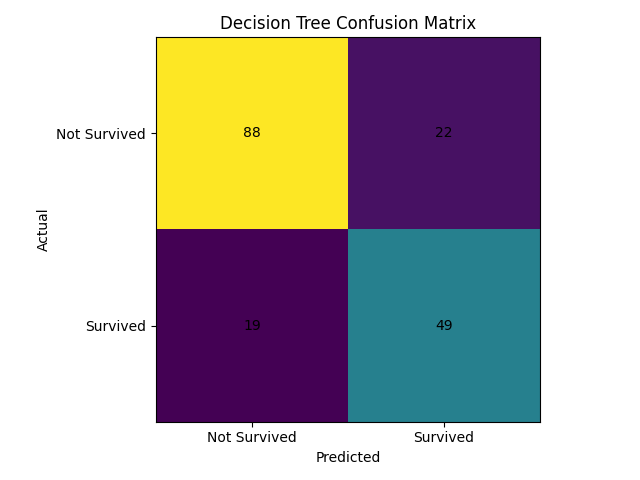

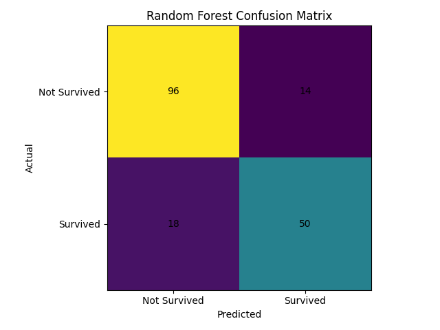

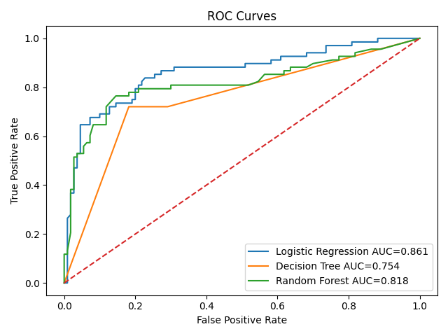

The Decision Tree was also visualized using `plot_tree` with feature names and class names.

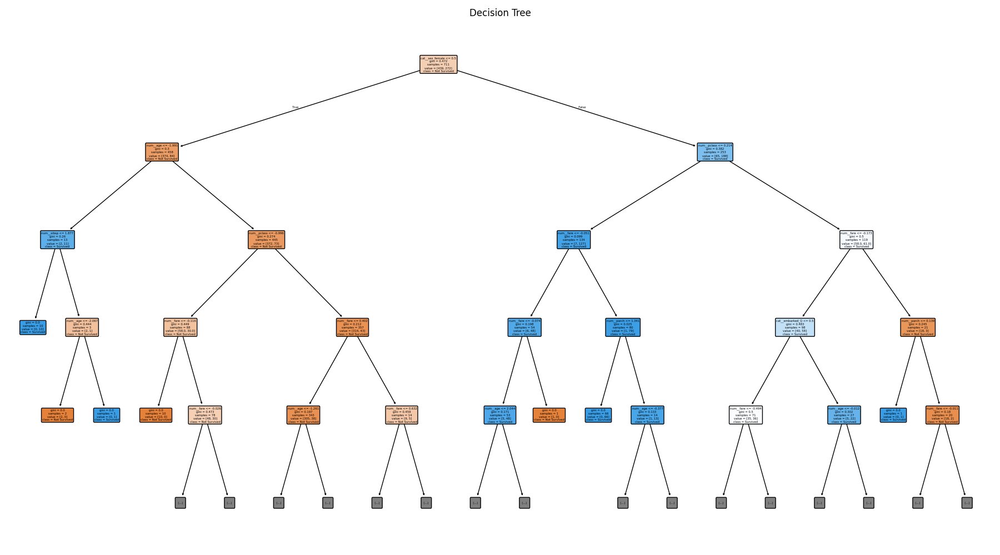

## Final Classifier Recommendation

Based on the observed test-set results, Random Forest achieved the highest accuracy at 0.8202 and the highest F1 score at 0.7576 among the three initial classifiers. Logistic Regression achieved the highest AUC at 0.8610, while Decision Tree achieved a recall of 0.7206. For this experiment, the Random Forest provides the strongest overall combination of accuracy, recall, and F1 among the initial classifiers.

## Class Imbalance

The target distribution contains:

- Class 0: 439 samples (61.74%)
- Class 1: 272 samples (38.26%)

Three approaches were compared using Logistic Regression:

| Method | Precision | Recall | F1 |
|---|---:|---:|---:|
| Baseline | 0.7833 | 0.6912 | 0.7344 |
| Class Weight Balanced | 0.7183 | 0.7500 | 0.7338 |
| SMOTE | 0.7353 | 0.7353 | 0.7353 |

Class weighting increased recall from 0.6912 to 0.7500 compared with the baseline. SMOTE increased recall to 0.7353 and produced the highest F1 score among the three imbalance approaches in this experiment. SMOTE was applied only to the training data, leaving the test data unchanged.

The SMOTE Logistic Regression evaluation produced:

- Accuracy = 0.7978
- Precision = 0.7353
- Recall = 0.7353
- F1 = 0.7353
- AUC = 0.8667

## Random Forest Grid Search

`GridSearchCV` was used to tune:

- `n_estimators`
- `max_depth`
- `max_features`

The Random Forest estimator was configured with `oob_score=True`.

Best parameters:

- `max_depth` = 5
- `max_features` = `sqrt`
- `n_estimators` = 200

Best cross-validation F1:

`0.7408`

OOB score:

`0.8214`

## Regression Side Task

A multivariate linear regression model was used to predict `fare` from selected non-fare Titanic features:

- `survived`
- `pclass`
- `age`
- `sibsp`
- `parch`
- `sex`
- `embarked`

The regression preprocessing used the same leakage-safe pipeline approach, with median imputation and scaling for numeric features and most-frequent imputation with one-hot encoding for categorical features.

### Regression Results

| Metric | Value |
|---|---:|
| MAE | 21.0986 |
| RMSE | 41.7021 |
| R² | 0.3482 |
| Adjusted R² | 0.3091 |

A residual plot was generated to assess the relationship between predicted fare and residuals.

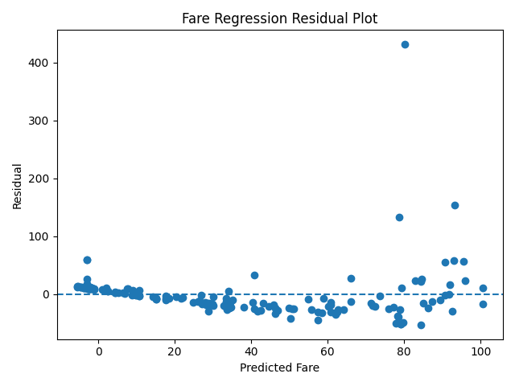

The residual spread varies across the fitted values, indicating some non-constant variance. Therefore, the regression results show evidence of mild heteroscedasticity.

# Final Model Comparison

The final comparison keeps the classification and regression metrics as separate metric groups.

| Model | Classification: Accuracy | Classification: Precision | Classification: Recall | Classification: F1 | Classification: AUC | Regression: MAE | Regression: RMSE | Regression: R² | Regression: Adjusted R² |
|---|---:|---:|---:|---:|---:|---:|---:|---:|---:|
| Logistic Regression | 0.8090 | 0.7833 | 0.6912 | 0.7344 | 0.8610 | — | — | — | — |
| Decision Tree | 0.7697 | 0.6901 | 0.7206 | 0.7050 | 0.7541 | — | — | — | — |
| Random Forest | 0.8202 | 0.7813 | 0.7353 | 0.7576 | 0.8179 | — | — | — | — |
| Linear Regression | — | — | — | — | — | 21.0986 | 41.7021 | 0.3482 | 0.3091 |

# Model Persistence

The fitted preprocessing and model pipeline was saved using Joblib:

`analytics/best_model_pipeline.joblib`

The saved pipeline was reloaded successfully using `joblib.load()`. A raw test input was passed through the reloaded pipeline, producing a prediction that was checked against the actual target value.

Example verification:

- Reloaded pipeline prediction = `0`
- Actual value = `0`

This confirms that the complete fitted pipeline can be saved, reloaded, and used for prediction on raw input data.

## Output Files

The module generates the following analysis artifacts:

- `titanic.csv`
- `age_histogram.png`
- `age_boxplot.png`
- `fare_histogram.png`
- `fare_boxplot.png`
- `survival_by_sex.png`
- `survival_by_class.png`
- `survival_by_sex_class.png`
- `correlation_heatmap.png`
- `decision_tree.png`
- `logistic_regression_confusion_matrix.png`
- `decision_tree_confusion_matrix.png`
- `random_forest_confusion_matrix.png`
- `roc_curves.png`
- `fare_residual_plot.png`
- `best_model_pipeline.joblib`

## How to Run

From the repository root:

```bash
python analytics/01_eda.py
python analytics/02_modeling.py